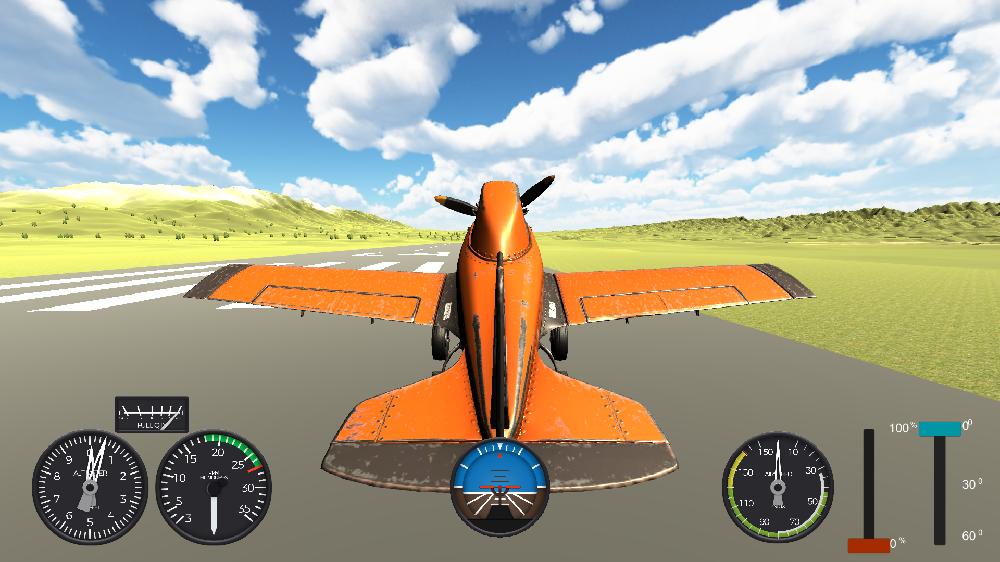

# FlightSim

## Take to the Skies

FlightSim is an immersive flight simulation experience that combines realistic aerodynamics with stunning visuals. Navigate open skies, master difficult landings, and experience the thrill of flight in this meticulously crafted simulator.

## Features

- **Realistic Flight Physics**: Experience authentic airplane behavior with detailed aerodynamic modeling
- **Detailed Cockpit**: Navigate with fully functional flight instruments including altimeter, airspeed indicator, and artificial horizon
- **Dynamic Environment**: Fly through beautiful landscapes with realistic terrain and water reflections
- **Multiple Aircraft**: Choose from different aircraft types with unique handling characteristics
- **Racing Challenges**: Test your skills in time trials and ring races through challenging courses
- **Day/Night Cycles**: Experience flying at different times of day with realistic lighting conditions

## Controls

FlightSim features intuitive controls that can be customized to your preference:
- Throttle control for speed management
- Pitch, roll, and yaw controls for precise maneuvering
- Camera controls to enjoy the view from multiple angles
- Advanced instrumentation for real-time flight data

## Getting Started

1. Select your aircraft model and configuration
2. Choose between arcade or simulation flight modes
3. Take off from one of several runways
4. Explore the open world or take on specific challenges

## Watch Gameplay

Check out our [racing gameplay video](preview/race.mov) to see FlightSim in action!

---

Built with Unity | © 2025 FlightSim